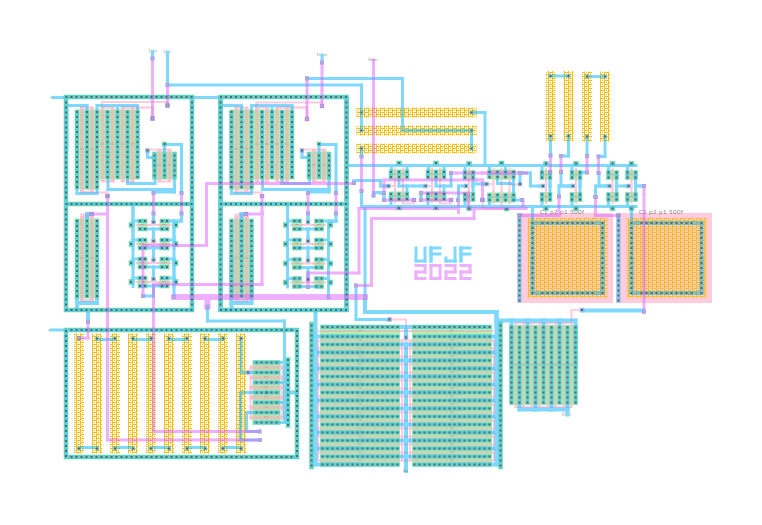

# 555 Replica

  

O repositório guarda a réplica do CI 555 desenvolvido na disciplina de projeto de circuitos integrados da UFJF, no semestre 2022.3. Projetado por Guilherme Sampaio, Diego de Souza e Wesley Cantarino.

portas.jelib é o projeto, e deve ser aberto com o programa electric VLSI. A pasta de simulação contem a simulação do CI em duas configurações, monoestável e astável. Para teste, foram executadas com o programa LTSpice.

-------------------

The repository holds the replica of the IC 555, developed in the class for integrated circuit design, at UFJF, on semester 2022.3. Design by Guilherme Sampaio, Diego de Souza and Wesley Cantarino.

portas.jelib is the project, and must be open using the program electric VLSI. The folder "simulacao" contains simulations for the device in two configurations, astable and monostable. For testing, both were executed with the program LTSpice.
